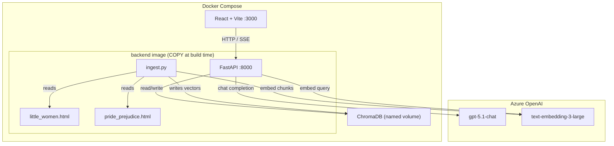

# Editorial AI POC — Interview Challenge

## 1. Open Questions to Investigate First

All key unknowns resolved during shaping. Proceeding to implementation.

| Question | Answer |
|---|---|
| What is Mowgli? | [app.mowgli.ai](https://app.mowgli.ai/) — AI design canvas. Free tier: screenshots + spec/prompt, no file export |
| Design tooling | Code-first prototype implemented from Mowgli output (screenshots + extracted CSS/prompt) |
| RAG depth | Basic semantic RAG for POC; advanced spike deferred to Phase 8 |
| Backend language | Python (FastAPI) |
| Presentation format | HTML slide deck |
| Streaming UX | Include SSE streaming — low effort, high demo impact |

---

## 2. Architecture Overview

### Key flow

1. **Ingest** — `ingest.py` parses both HTML books, chunks by chapter + paragraph overlap, embeds with `text-embedding-3-large`, stores in ChromaDB (one collection per book).
2. **Query** — React sends a message to `POST /api/chat`. Backend embeds the query, retrieves top-k chunks from the relevant collection(s), builds a prompt with retrieved context + conversation history, calls GPT-5.1.
3. **Stream** — Backend streams GPT-5.1 tokens via SSE. React reads via `EventSource`, renders progressively.
4. **Cross-book** — When comparing books, backend queries both collections, merges retrieved passages, prompts LLM to synthesize with explicit source attribution.



### Component table

| Component | What it is | Where it runs | Deployed how |
|---|---|---|---|
| React + Vite | Chat UI, book selector, source cards | Container `:3000` | `docker compose up` |
| FastAPI | REST + SSE API, RAG orchestration | Container `:8000` | `docker compose up` |
| ChromaDB | Local vector store (2 collections) | Persistent volume `/data/chroma` | Auto-init on first run |
| `ingest.py` | One-shot book parsing + embedding | Inside backend image (run once) | `docker compose run --rm backend python ingest.py` |
| Azure OpenAI | GPT-5.1-chat + text-embedding-3-large | External SaaS | API key in `.env` |

### Cost estimate (dev)

- Azure OpenAI GPT-5.1: charged per token at evaluation account rates — POC usage is negligible
- text-embedding-3-large: ~$0.13/1M tokens — 2 full books ≈ 500k tokens → < $0.10 total for ingestion
- ChromaDB: free, local
- Docker: local, free

---

## 3. Design Exploration Strategy (Mowgli)

### What Mowgli produces

Mowgli is an AI design canvas that generates UI designs from prompts. Free tier provides:
- **Screenshots** of generated screens (the primary design artefact)
- **Spec / prompt text** that describes components, layout, spacing, colors

### Workflow

```
Mowgli prompt → UI screenshot(s) → extract: colors, typography, layout → Claude implements React
```

**Mowgli prompt to use** (copy-paste into Mowgli):

> Design a minimal, desktop web app for editorial teams at a book publishing company.
>
> **Layout**: Single-column, centered, max-width ~800px. No sidebar. Three vertical regions stacked top to bottom: (1) app header, (2) book toggle, (3) chat area.
>
> **App header**: A slim top bar with the app name "Editorial AI" on the left in deep navy, no logo, no nav links. Background same as page (#FAFAF8) with a subtle bottom border in a light grey.
>
> **Book toggle (BookToggle)**: A 3-segment pill control sitting below the header, centered. The three segments are labelled "Little Women", "Both Books", "Pride & Prejudice". The active segment has a warm amber background (#D97706) with white text and slightly rounded corners. Inactive segments are transparent with navy text. The whole pill has a thin navy border. Clicking a segment switches the active book context for the chat below.
>
> **Chat area (ChatPanel)**: Takes up the remaining vertical space. Contains two sub-regions:
>
> — **Message list (MessageList)**: a scrollable feed of conversation turns. Each turn is one of:
>   - *User message (UserMessage)*: right-aligned bubble with a light amber tint background, navy text, rounded corners. No avatar.
>   - *AI message (AssistantMessage)*: left-aligned, white background, navy text, subtle drop shadow, rounded corners. While the AI is still generating, show three animated pulsing dots inside the bubble as a loading indicator. When complete, the full text appears.
>   - *Source cards (SourceCard, rendered below each completed AI message)*: a horizontal row of 1–3 small cards. Each card has a white background, a 1px navy border, rounded corners, and two lines of content: line 1 — book title in small amber uppercase text + chapter name in navy bold; line 2 — a 1–2 sentence passage excerpt in a smaller, slightly muted navy. Cards sit flush left, aligned with the AI bubble above them.
>
> — **Chat input (ChatInput)**: pinned to the bottom of the chat area. A full-width rounded textarea (1–3 lines auto-expanding) with a send button on the right. Send button uses the amber accent as background. Placeholder text: "Ask something about the book…"
>
> **Colors**: off-white page background #FAFAF8 · deep navy text #1A1A2E · warm amber accent #D97706 · white card/bubble backgrounds · light grey borders where needed.
>
> **Typography**: Inter (or similar clean sans-serif). Body 15px, chapter names 13px bold, excerpts 12px muted, header app name 18px medium.
>
> **Aesthetic**: calm, editorial, professional. No decorative illustrations. No gradients except subtle shadows. Feels like a tool a book editor would trust.

**What to extract after Mowgli generates:**

- [ ] Screenshot of full layout with segmented toggle + chat panel (save to `docs/design/`)
- [ ] Screenshot of a source citation card component
- [ ] Note the exact hex colors Mowgli uses (may differ from prompt)
- [ ] Note the typography/font choices
- [ ] Note key spacing values (toggle height, card padding, chat bubble gap)

### Design decisions (locked in for implementation)

| Decision | Value | Rationale |
|---|---|---|
| Color palette | Off-white bg, deep navy text, amber accent | Editorial, calm, professional — matches book domain |
| Typography | Inter (Google Fonts, free) | Clean, highly legible at small sizes |
| Component library | None (plain CSS + CSS variables) | Faithfully match Mowgli output; no framework imposing its look |
| Layout | Single-column — toggle + chat | 2 books don't warrant a sidebar; simpler to build and demo |
| Book selector | 3-way segmented toggle | Exposes cross-book comparison with one click; looks intentional |
| Source display | Citation cards per answer | Grounds AI responses in actual retrieved passages — key for editors |
| Responsive | Desktop-first (evaluators will run locally) | Scope — mobile out of scope for POC |

---

## 4. Backend Strategy (Python / FastAPI)

### Decision
FastAPI over Flask/Django — async-native (required for SSE streaming), fast startup, auto OpenAPI docs (bonus for showing evaluators the API).

### Key Python dependencies

```
fastapi==0.115.*
uvicorn[standard]==0.32.*
openai==1.57.*          # Azure OpenAI SDK
chromadb==0.6.*
beautifulsoup4==4.13.*
lxml==5.3.*
python-dotenv==1.0.*

# Phase 8 spike only (not needed for core POC)
ragas==0.2.*            # RAG evaluation framework (Phase 8.3)
datasets==3.*           # required by ragas for golden set handling
```

### Book ingestion (`ingest.py`)

**Parsing strategy** — HTML books have consistent structure (chapter headings, paragraphs):

```python
# 1. Parse HTML with BeautifulSoup
# 2. Walk the DOM: find <h2>/<h3> chapter headings
# 3. Collect paragraphs under each heading into a chapter "section"
# 4. If section > 1000 tokens, chunk with 150-token overlap
# 5. Each chunk: {book_id, chapter_title, chunk_index, text}
# 6. Embed all chunks in batches of 100 → store in ChromaDB collection
```

**Why chapter-aware chunking matters**: raw paragraph chunking loses chapter context. Keeping the chapter title as metadata allows source citations to say "Chapter 12: The Picnic" rather than an anonymous chunk ID.

**ChromaDB setup**:
- Two collections: `little_women`, `pride_prejudice`
- Metadata per document: `book_id`, `chapter_title`, `chunk_index`
- Persistent client writing to `./data/chroma`

### API endpoints

| Endpoint | Method | Description |
|---|---|---|
| `GET /api/books` | GET | List available books (title, id, chapter count) |
| `POST /api/chat` | POST | SSE streaming — single-book Q&A |
| `POST /api/compare` | POST | SSE streaming — cross-book comparison |
| `GET /api/health` | GET | Health check (for Docker) |

### Chat endpoint design

```
POST /api/chat
{
  "book_id": "little_women" | "pride_prejudice" | "both",
  "message": "What is Jo's relationship with Laurie?",
  "history": [{"role": "user"/"assistant", "content": "..."}]
}
→ SSE stream: data: {"token": "Jo and..."}\n\n
→ SSE stream: data: {"sources": [{book, chapter, excerpt}]}\n\n
→ SSE stream: data: {"done": true}\n\n
```

**Sources sent as a final event** (not inline with tokens) — keeps streaming simple: render tokens progressively, then render source cards when `done: true` arrives.

### RAG retrieval

- Embed query with `text-embedding-3-large`
- Query ChromaDB collection(s) for top-5 chunks
- Build system prompt:

```
You are an editorial assistant for a book publishing company.
Answer based ONLY on the provided passages. If the answer is not in the passages, say so.
Always cite which book and chapter each piece of information comes from.

Retrieved passages:
[CHUNK 1] Book: Little Women | Chapter: Playing Pilgrims
"..."
[CHUNK 2] ...
```

### Streaming implementation (FastAPI SSE)

```python
from fastapi.responses import StreamingResponse

async def stream_chat(request: ChatRequest):
    async def generate():
        # retrieve RAG context
        # call Azure OpenAI with stream=True
        async for chunk in completion:
            token = chunk.choices[0].delta.content or ""
            if token:
                yield f"data: {json.dumps({'token': token})}\n\n"
        yield f"data: {json.dumps({'sources': sources})}\n\n"
        yield f"data: {json.dumps({'done': True})}\n\n"
    return StreamingResponse(generate(), media_type="text/event-stream")
```

---

## 5. Frontend Strategy (React + Vite)

### Stack decisions

| Decision | Value | Rationale |
|---|---|---|
| Framework | React 18 | Required by challenge; best ecosystem for streaming UI |
| Build tool | Vite | Fast dev server, minimal config |
| Styling | Plain CSS + CSS custom properties | Match Mowgli output exactly, no override fights |
| State | React `useState`/`useReducer` | No external state library needed for a 2-panel POC |
| Streaming | `EventSource` (native browser API) | SSE support built in; no libraries needed |
| HTTP | `fetch` | No Axios/SWR needed for 2–3 endpoints |

### Component tree

```
App
├── BookToggle          ← 3-way segmented control (Little Women · Both · Pride & Prejudice)
└── ChatPanel
    ├── MessageList
    │   ├── UserMessage
    │   ├── AssistantMessage (streaming cursor while loading)
    │   └── SourceList
    │       └── SourceCard (book title · chapter · passage excerpt)
    └── ChatInput (textarea + send button)
```

**SourceCard** — a small bordered card rendered below each completed AI response. Contains:
- Book title (e.g. "Little Women") + chapter name ("Chapter 9 — Meg Goes to Vanity Fair")
- 1–3 sentence excerpt from the actual retrieved passage, in a slightly smaller font
- Purpose: lets editors verify the AI's answer against the real text; prevents hallucination going unnoticed

### Streaming in React

```jsx
const source = new EventSource('/api/chat');
source.onmessage = (e) => {
  const data = JSON.parse(e.data);
  if (data.token) setStreamingText(prev => prev + data.token);
  if (data.sources) setSources(data.sources);
  if (data.done) { source.close(); setIsStreaming(false); }
};
```

---

## 6. Infrastructure Strategy (Docker)

### Docker Compose structure

```yaml
services:
  backend:
    build: ./backend
    ports: ["8000:8000"]
    env_file: .env
    volumes:
      - chroma_data:/app/data/chroma
    healthcheck:
      test: ["CMD", "curl", "-f", "http://localhost:8000/api/health"]

  frontend:
    build: ./frontend
    ports: ["3000:3000"]
    depends_on: [backend]

volumes:
  chroma_data:
```

### Why no separate ChromaDB container

ChromaDB's embedded mode (in-process) is sufficient for a POC and eliminates a third service. Data persists in a named Docker volume. If we needed a shared vector store across multiple backend replicas, we'd add the ChromaDB server container — deferred.

### Books inside the Docker image — POC decision

The two source books (`little_women.html`, `pride_prejudice.html`) are `COPY`'d into the backend image at build time rather than mounted as a host volume.

**Why this is acceptable here:**
- This is a time-boxed POC, not a production system
- The dataset is fixed (2 books, provided for the challenge) — no need to add/swap books at runtime
- Both files are small (plain HTML, classic literature from Project Gutenberg — well under 5 MB each)
- Baking them in keeps the deliverable self-contained: `docker compose up` works without any host path setup

**What we would do in production:**
- Books would be stored in an object store (S3, GCS, Azure Blob) or a dedicated document DB
- The backend would receive a book URI and stream/download the source on demand
- Ingestion would be a triggered job (e.g. on upload event), not a one-shot CLI
- The Docker image would contain no book data — only application code

### Ingestion flow

```bash
# First time only — populates ChromaDB with both books
docker compose run --rm backend python ingest.py
# Then start the full stack
docker compose up
```

---

## 7. Proposed Directory Structure

```
book-publishing-company/
├── .env                         # Azure OpenAI credentials (already exists)
├── .env.template                # Template for setup (already exists)
├── docker-compose.yml           # Full-stack orchestration
├── books shared/                # Source books (already exists)
│   ├── little_women.html
│   └── pride_prejudice.html
├── backend/
│   ├── Dockerfile
│   ├── requirements.txt
│   ├── ingest.py                # One-shot book ingestion CLI
│   ├── main.py                  # FastAPI app entrypoint
│   ├── api/
│   │   ├── routes/
│   │   │   ├── books.py         # GET /api/books
│   │   │   ├── chat.py          # POST /api/chat (SSE)
│   │   │   └── compare.py      # POST /api/compare (SSE)
│   │   └── deps.py             # Shared dependencies (ChromaDB client, AzureOpenAI client)
│   └── core/
│       ├── ingestion.py         # HTML parsing + chunking logic
│       ├── embeddings.py        # Embedding helper (batch embed)
│       ├── retrieval.py         # ChromaDB query + top-k retrieval
│       └── prompts.py          # System prompt templates
├── frontend/
│   ├── Dockerfile
│   ├── package.json
│   ├── vite.config.js
│   ├── index.html
│   └── src/
│       ├── main.jsx
│       ├── App.jsx
│       ├── styles/
│       │   └── globals.css      # CSS variables from Mowgli palette
│       └── components/
│           ├── BookToggle.jsx        # 3-way segmented control
│           ├── ChatPanel.jsx
│           ├── MessageList.jsx
│           ├── AssistantMessage.jsx  # Handles streaming cursor
│           └── SourceCard.jsx        # Citation card (book, chapter, excerpt)
└── docs/
    ├── design/                  # Mowgli screenshots (saved manually)
    └── tasks/
        └── editorial-ai-poc.plan.md  # This file
```

---

## 8. What is NOT Covered (Deferred)

| Topic | Why deferred |
|---|---|
| **RAG Depth Spike** (Phase 8) | Core POC uses basic top-k semantic search — sufficient for requirements. Advanced techniques planned but not needed for demo. |
| Authentication / sessions | No auth needed for a local POC with one user |
| Persistent conversation history | In-memory per-request history only; no DB storage |
| Mobile / responsive UI | Desktop-first per scope decision |
| More than 2 books | Dataset provided is 2 books — ingestion pipeline is generic |
| ChromaDB server mode | Embedded mode is sufficient for local single-backend POC |
| CI/CD | Local-only per requirements |
| Production deployment | Local Docker only per requirements |
| Fine-tuning | Out of scope |

---

## 9. Risks and Watch-outs

| Risk | Likelihood | Mitigation |
|---|---|---|
| Azure OpenAI API key expired/rate-limited | Low — key is provided | Test with a simple curl before building; add retry logic |
| HTML book structure inconsistent (breaks chapter chunker) | Medium — old Project Gutenberg HTML can be messy | Inspect both HTMLs first; fallback to paragraph-only chunking |
| Mowgli free tier limits (sessions, exports) | Medium | Take screenshots immediately; document color/font values before session expires |
| SSE not working behind certain proxies | Low — local Docker only | Not a concern for local dev |
| ChromaDB embedding dimension mismatch on re-ingest | Low | Delete volume before re-ingesting if changing embedding model |

---

## 10. Setup Checklist

### Phase 0 — Manual Prerequisites

- `[MANUAL]` Confirm Azure OpenAI API key is valid: `curl -H "api-key: $AZURE_OPENAI_API_KEY" "$AZURE_OPENAI_ENDPOINT/openai/deployments?api-version=$AZURE_OPENAI_API_VERSION"`
- `[MANUAL]` Confirm Docker Desktop is installed and running: `docker info`
- `[MANUAL]` Confirm Python 3.11+ is available: `python3 --version`
- `[MANUAL]` Confirm Node 18+ is available: `node --version`
- `[MANUAL]` Open [app.mowgli.ai](https://app.mowgli.ai/) — log in or create free account
- `[MANUAL]` Inspect both HTML books to understand DOM structure before agent implements the chunker:
  - `book-publishing-company/books shared/little_women.html` — note heading tags used
  - `book-publishing-company/books shared/pride_prejudice.html` — note heading tags used

### Phase 1 — Design Exploration (Mowgli)

- `[MANUAL]` Paste the Mowgli prompt (§3 above) into Mowgli and generate the UI
- `[MANUAL]` Iterate on the Mowgli design until satisfied with the layout
- `[MANUAL]` Take screenshots of: (a) full 2-panel layout, (b) source citation card, (c) book sidebar card
- `[MANUAL]` Save screenshots to `docs/design/` in the project
- `[MANUAL]` Extract and record: exact hex colors, font name, sidebar width, key spacing values
- `[MANUAL]` Write a 1-paragraph "design spec note" describing the Mowgli output (used as context for the frontend agent)

### Phase 2 — Project Scaffolding

- `[AGENT]` Create `backend/` directory structure (see §7)
- `[AGENT]` Create `frontend/` directory structure with Vite + React scaffold
- `[AGENT]` Write `docker-compose.yml` with backend + frontend services + chroma_data volume
- `[AGENT]` Write `backend/Dockerfile` (Python 3.12 slim, installs requirements)
- `[AGENT]` Write `frontend/Dockerfile` (Node 18 alpine, Vite build)
- `[AGENT]` Write `backend/requirements.txt` with pinned versions
- `[AGENT]` Write `frontend/package.json` with Vite + React dependencies

### Phase 3 — Book Ingestion Pipeline

- `[AGENT]` Write `backend/core/ingestion.py` — HTML parser + chapter-aware chunker
- `[AGENT]` Write `backend/core/embeddings.py` — Azure OpenAI batch embedding helper
- `[AGENT]` Write `backend/ingest.py` — CLI entrypoint: ingest both books into ChromaDB
- `[MANUAL]` Run ingestion and verify: `docker compose run --rm backend python ingest.py`
- `[MANUAL]` Smoke test ChromaDB: confirm both collections exist with chunk counts

### Phase 4 — AI Assistant Backend

- `[AGENT]` Write `backend/core/retrieval.py` — ChromaDB top-k query, formats retrieved chunks
- `[AGENT]` Write `backend/core/prompts.py` — system prompt templates for Q&A and comparison
- `[AGENT]` Write `backend/api/deps.py` — shared ChromaDB + AzureOpenAI client singletons
- `[AGENT]` Write `backend/api/routes/books.py` — `GET /api/books`
- `[AGENT]` Write `backend/api/routes/chat.py` — `POST /api/chat` with SSE streaming
- `[AGENT]` Write `backend/api/routes/compare.py` — `POST /api/compare` with SSE streaming
- `[AGENT]` Write `backend/main.py` — FastAPI app wiring CORS, routes, lifespan
- `[MANUAL]` Test endpoints directly: `curl http://localhost:8000/api/health`
- `[MANUAL]` Test chat streaming: `curl -N -X POST http://localhost:8000/api/chat -H "Content-Type: application/json" -d '{"book_id":"little_women","message":"Who is Jo?","history":[]}'`

### Phase 5 — Frontend Implementation

- `[MANUAL]` Share Mowgli screenshots + design spec note with agent as context
- `[AGENT]` Write `src/styles/globals.css` — CSS variables from Mowgli palette
- `[AGENT]` Write `src/components/BookToggle.jsx` — 3-way segmented control (Little Women · Both · Pride & Prejudice), amber highlight on active segment
- `[AGENT]` Write `src/components/ChatPanel.jsx` — input, message list, send handler
- `[AGENT]` Write `src/components/AssistantMessage.jsx` — handles SSE streaming cursor
- `[AGENT]` Write `src/components/SourceCard.jsx` — citation card: book title, chapter name, passage excerpt
- `[AGENT]` Write `src/App.jsx` — single-column layout, toggle state drives `book_id` sent to backend
- `[MANUAL]` Verify UI in browser at `http://localhost:3000` — visual check against Mowgli screenshots

### Phase 6 — Integration + Docker

- `[AGENT]` Add Vite proxy config (`/api` → `http://backend:8000`) for Docker networking
- `[MANUAL]` Run full stack: `docker compose up --build`
- `[MANUAL]` End-to-end smoke tests:
  - Ask "What is the plot of Little Women?" (single book)
  - Ask "How do Elizabeth Bennet and Jo March compare as protagonists?" (cross-book comparison)
  - Verify source citation cards appear with correct book/chapter attribution
  - Verify streaming (tokens appear progressively, not all at once)
- `[AGENT]` Write `README.md` with setup instructions, approach explanation, key decisions + trade-offs
- `[AGENT]` Create `.zip` of project (excluding `.env`, `node_modules`, `__pycache__`, chroma data)

### Phase 7 — Presentation Deck

- `[AGENT]` Generate HTML slide deck covering:
  - Slide 1: Title — "Editorial AI Assistant POC"
  - Slide 2: Problem — editorial team needs + use cases
  - Slide 3: Architecture diagram — 2-panel stack with flow
  - Slide 4: Key decisions — Python/FastAPI, ChromaDB, SSE streaming, chapter-aware chunking
  - Slide 5: Design journey — Mowgli → code (include screenshot)
  - Slide 6: Demo flow — 3 demo scenarios (single Q&A, passage ID, cross-book compare)
  - Slide 7: Trade-offs + what's deferred (RAG spike)
  - Slide 8: Next steps if productionized
- `[MANUAL]` Review deck, verify screenshot embeds correctly, confirm flow narrative

### Phase 8 — RAG Depth Spike (deferred)

#### 8.1 — Contextual Chunk Enrichment

Technique: before embedding each chunk, call the LLM to generate a ≤50-token situating header
that places the chunk in its document context, then prepend it to the chunk text before embedding.

> **Why it helps:** chunks often contain generic prose ("She said yes") that embeds poorly in
> isolation. The header anchors the embedding to the chapter, character, and narrative thread,
> dramatically improving retrieval precision — especially for cross-book comparisons where similar
> surface language appears in different contexts.

Example:
```
[Context: Little Women, Ch. 9 — Jo refuses Laurie's marriage proposal, asserting her independence.]
"I shall never marry," said Jo, with a determined air...
```

Tasks:
- `[AGENT]` Add `contextual_header()` function to `core/ingestion.py` — calls GPT-5.1 with the
  full chapter text + chunk, prompts for a ≤50-token situating sentence
- `[AGENT]` Update `ingest.py` to enrich chunks before embedding (adds one LLM call per chunk —
  ~2–4× ingestion cost; acceptable for a spike over 2 books)
- `[AGENT]` Store original chunk text separately in ChromaDB metadata so citations still show the
  clean original passage (not the header-prefixed version)
- `[MANUAL]` Re-ingest both books with contextual enrichment enabled (delete chroma volume first)
- `[MANUAL]` A/B compare: same 10 queries against baseline vs enriched — compare retrieved chunks,
  note precision improvement

**Cost note:** 2 books × ~200 chunks each × 1 LLM call = ~400 calls. At GPT-5.1 rates over the
eval account, negligible for a spike.

#### 8.2 — Retrieval Improvements

- `[INVESTIGATE]` Chunking strategies: fixed-size vs semantic vs sentence-window
- `[INVESTIGATE]` Hybrid search: BM25 keyword + semantic (RRF fusion) — better for specific passage ID
- `[INVESTIGATE]` Query decomposition: complex comparison questions → sub-questions → merge
- `[INVESTIGATE]` Re-ranking: cross-encoder to improve top-k precision
- `[INVESTIGATE]` Metadata filtering: let users filter by chapter before semantic search
- `[AGENT]` Implement findings from above investigations

#### 8.3 — Evaluation Framework

**Framework: RAGAS** — evaluates the RAG pipeline end-to-end using LLM-as-judge, no labelled
ground truth required beyond the golden Q&A set.

RAGAS measures four dimensions automatically using LLM-as-judge:

| Metric | What it checks |
|---|---|
| **Faithfulness** | Is the answer grounded in the retrieved passages? |
| **Answer Relevancy** | Does the answer actually address the question asked? |
| **Context Precision** | Are retrieved chunks relevant (not noisy)? |
| **Context Recall** | Did retrieval surface all necessary content? |

Tasks:
- `[AGENT]` Create `eval/golden_set.json` — 15–20 hand-crafted Q&A pairs across both books,
  covering: single-book factual, passage identification, cross-book comparison
- `[AGENT]` Write `eval/run_eval.py` — runs each question against the RAG pipeline, collects
  (question, answer, retrieved_contexts, ground_truth), scores with RAGAS
- `[MANUAL]` Run baseline eval: `python eval/run_eval.py --variant baseline`
- `[MANUAL]` Run enriched eval (after Phase 8.1): `python eval/run_eval.py --variant contextual`
- `[MANUAL]` Compare scores across both variants; document deltas in `eval/results/`
