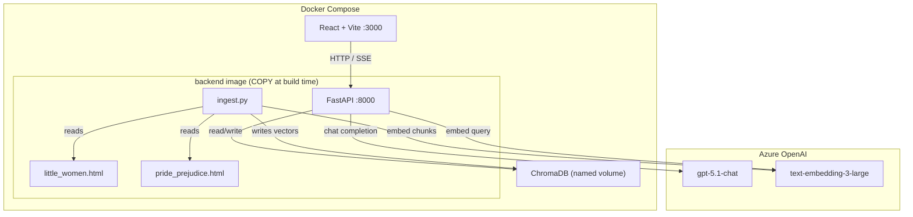

# Editorial AI POC — Interview Challenge

## 1. Open Questions to Investigate First

All key unknowns resolved during shaping. Proceeding to implementation.

| Question            | Answer                                                                                                           |
| ------------------- | ---------------------------------------------------------------------------------------------------------------- |
| What is Mowgli?     | [app.mowgli.ai](https://app.mowgli.ai/) — AI design canvas. Free tier: screenshots + spec/prompt, no file export |
| Design tooling      | Code-first prototype implemented from Mowgli output (screenshots + extracted CSS/prompt)                         |
| RAG depth           | Basic semantic RAG for POC; advanced spike deferred to Phase 8                                                   |
| Backend language    | Python (FastAPI)                                                                                                 |
| Presentation format | HTML slide deck                                                                                                  |
| Streaming UX        | Include SSE streaming — low effort, high demo impact                                                             |

---

## 2. Architecture Overview

### Key flow

1. **Ingest** — `ingest.py` parses both HTML books (chapter-aware, DOM-derived metadata), chunks at ~500 tokens with paragraph overlap, embeds with `text-embedding-3-large`, stores in a single ChromaDB `books` collection tagged by `book_id`.
2. **Query** — React sends a message to `POST /api/chat`. Backend embeds the query, retrieves top-k chunks from the `books` collection (filtered by `book_id`, or unfiltered for cross-book), builds a prompt with retrieved context + conversation history, calls GPT-5.1.
3. **Stream** — Backend streams GPT-5.1 tokens via SSE. React reads the response `ReadableStream` (`fetch`, **not** `EventSource` — see §5), renders progressively.
4. **Cross-book** — `book_id: "both"` runs the _same_ query path with no `where` filter, giving one globally ranked top-k across both books. There is no separate compare path and no per-book merge step.



### Component table

| Component    | What it is                                                       | Where it runs                    | Deployed how                                       |
| ------------ | ---------------------------------------------------------------- | -------------------------------- | -------------------------------------------------- |
| React + Vite | Chat UI, book selector, source cards                             | Container `:3000`                | `docker compose up`                                |
| FastAPI      | REST + SSE API, RAG orchestration                                | Container `:8000`                | `docker compose up`                                |
| ChromaDB     | Local vector store (1 `books` collection, filtered by `book_id`) | Persistent volume `/data/chroma` | Auto-init on first run                             |
| `ingest.py`  | One-shot book parsing + embedding                                | Inside backend image (run once)  | `docker compose run --rm backend python ingest.py` |
| Azure OpenAI | GPT-5.1-chat + text-embedding-3-large                            | External SaaS                    | API key in `.env`                                  |

### Cost estimate (dev)

- Azure OpenAI GPT-5.1: charged per token at evaluation account rates — POC usage is negligible
- text-embedding-3-large: ~$0.13/1M tokens — 2 full books ≈ 500k tokens → < $0.10 total for ingestion
- ChromaDB: free, local
- Docker: local, free

---

## 3. Design Exploration Strategy (Mowgli)

### What Mowgli produces

Mowgli is an AI design canvas that generates UI designs from prompts. Free tier provides:

- **Screenshots** of generated screens (the primary design artefact)
- **Spec / prompt text** that describes components, layout, spacing, colors

### Workflow

```
Mowgli prompt → UI screenshot(s) → extract: colors, typography, layout → Claude implements React
```

**Mowgli prompt to use** (copy-paste into Mowgli):

> Design a minimal, desktop web app for editorial teams at a book publishing company.
>
> **Layout**: Single-column, centered, max-width ~800px. No sidebar. Three vertical regions stacked top to bottom: (1) app header, (2) book toggle, (3) chat area.
>
> **App header**: A slim top bar with the app name "Editorial AI" on the left in deep navy, no logo, no nav links. Background same as page (#FAFAF8) with a subtle bottom border in a light grey.
>
> **Book toggle (BookToggle)**: A 3-segment pill control sitting below the header, centered. The three segments are labelled "Little Women", "Both Books", "Pride & Prejudice". The active segment has a warm amber background (#D97706) with white text and slightly rounded corners. Inactive segments are transparent with navy text. The whole pill has a thin navy border. Clicking a segment switches the active book context for the chat below.
>
> **Chat area (ChatPanel)**: Takes up the remaining vertical space. Contains two sub-regions:
>
> — **Message list (MessageList)**: a scrollable feed of conversation turns. Each turn is one of:
>
> - _User message (UserMessage)_: right-aligned bubble with a light amber tint background, navy text, rounded corners. No avatar.
> - _AI message (AssistantMessage)_: left-aligned, white background, navy text, subtle drop shadow, rounded corners. While the AI is still generating, show three animated pulsing dots inside the bubble as a loading indicator. When complete, the full text appears.
> - _Source cards (SourceCard, rendered below each completed AI message)_: a horizontal row of 1–3 small cards. Each card has a white background, a 1px navy border, rounded corners, and two lines of content: line 1 — book title in small amber uppercase text + chapter name in navy bold; line 2 — a 1–2 sentence passage excerpt in a smaller, slightly muted navy. Cards sit flush left, aligned with the AI bubble above them.
>
> — **Chat input (ChatInput)**: pinned to the bottom of the chat area. A full-width rounded textarea (1–3 lines auto-expanding) with a send button on the right. Send button uses the amber accent as background. Placeholder text: "Ask something about the book…"
>
> **Colors**: off-white page background #FAFAF8 · deep navy text #1A1A2E · warm amber accent #D97706 · white card/bubble backgrounds · light grey borders where needed.
>
> **Typography**: Inter (or similar clean sans-serif). Body 15px, chapter names 13px bold, excerpts 12px muted, header app name 18px medium.
>
> **Aesthetic**: calm, editorial, professional. No decorative illustrations. No gradients except subtle shadows. Feels like a tool a book editor would trust.

### What Mowgli actually returned — the design is now the contract

Delivered artefacts: `docs/design/desing-spec-mowgli.txt` (regenerated spec) + 7 state screenshots (`1-welcome-screen` … `7-conversation-continues`).

**The prompt above is history, not spec.** Mowgli's returned spec text mostly echoes the prompt back — including its hex values — but the _render_ departs from the prompt in several deliberate, better ways. Where the screenshots and any prose disagree, **the screenshots win**. The table below is what gets built.

#### Design tokens — sampled from the PNG pixels, not from the prompt

| Token              | Value     | Prompt said  | Used for                                                      |
| ------------------ | --------- | ------------ | ------------------------------------------------------------- |
| `--bg`             | `#F9F9F7` | `#FAFAF8`    | Page + header background                                      |
| `--ink`            | `#181928` | `#1A1A2E`    | Body text, active segment fill                                |
| `--accent`         | `#CB7026` | `#D97706`    | Send button (enabled), `AI` label, left rule, source eyebrows |
| `--surface`        | `#FFFFFF` | —            | User bubble, source cards, inactive pill segments             |
| `--surface-subtle` | `#FCFCFB` | —            | Suggested-question buttons on the welcome screen              |
| `--hairline`       | `#E4E2DC` | "light grey" | All 1px borders, dividers, disabled send button               |

The prompt's amber `#D97706` is a saturated orange; the render's `#CB7026` is a muted terracotta. The prompt's navy `#1A1A2E` is bluer than the rendered `#181928`. **Use the sampled column** — it is what the evaluator sees in the screenshots.

#### Where the render overrode the prompt (adopt the render)

| #   | Prompt / earlier plan said                  | Render does                                                                                                                                                                                     | Verdict                                                                                   |
| --- | ------------------------------------------- | ----------------------------------------------------------------------------------------------------------------------------------------------------------------------------------------------- | ----------------------------------------------------------------------------------------- |
| 1   | Active toggle segment = **amber** fill      | Active segment = **navy `#181928`** fill, white text; inactive = white on the off-white page                                                                                                    | **Render.** Amber is reserved for accents only — a more coherent system.                  |
| 2   | AI turn = white **bubble** with drop shadow | AI turn = **no bubble**. A 2px amber left rule, a mono `AI` label + timestamp, then plain body text running the full column width                                                               | **Render.** Long editorial prose reads far better unboxed. Biggest structural difference. |
| 3   | User bubble = **light amber tint**          | User bubble = **white** card, hairline border, right-aligned, ~55% column width, timestamp bottom-right                                                                                         | **Render.**                                                                               |
| 4   | Header = app name only                      | Two-line header: mono eyebrow `A READING COMPANION FOR EDITORS` above `Editorial AI`, plus `VOL. 01 / 2024` right-aligned                                                                       | **Render, with one change** — see "Design defects" below.                                 |
| 5   | Typography = Inter only                     | **Two** typefaces: sans (Inter-like) for body/UI + a **letterspaced uppercase monospace** for every micro-label (eyebrow, `VOL. 01 / 2024`, `CONVERSATION`, `AI`, `SOURCE 01 / 03`, timestamps) | **Render.** The mono micro-label is the design's signature. Add a second font.            |
| 6   | (absent)                                    | A `CONVERSATION` mono divider above the first turn; hairline rules between turns                                                                                                                | **Render.**                                                                               |
| 7   | (absent)                                    | Open-book glyph icon inside each toggle segment                                                                                                                                                 | **Render.** Inline SVG, `currentColor`.                                                   |
| 8   | (absent)                                    | Per-message `14:33` timestamps                                                                                                                                                                  | **Render.** Client-generated — the SSE payload carries no timestamp.                      |
| 9   | Welcome greeting = an AI message            | Welcome greeting = large centered display line, mixed italic/roman: _"Ready to answer questions about"_ **Little Women** _and_ **Pride & Prejudice.** — not a chat bubble                       | **Render.** Simpler; no fake first turn in the message array.                             |

#### Design defects — where the render loses

| #   | Defect                                                                                                                                                                                                                                            | Resolution                                                                                                                                            |
| --- | ------------------------------------------------------------------------------------------------------------------------------------------------------------------------------------------------------------------------------------------------- | ----------------------------------------------------------------------------------------------------------------------------------------------------- |
| A   | **Source card row overflows the column.** Measured on `5-ai-response-sources.png`: column is 927px of a 2386px render, each card 344px, 3 cards + gaps ≈ 1064px. Card 3 is clipped ~40% at the right edge in every screenshot that shows sources. | Cards are `flex: 1 1 0` inside the column and share the width equally — 3 cards, no overflow, no scroll. Excerpt clamps with `-webkit-line-clamp: 4`. |
| B   | `VOL. 01 / 2024` hardcodes a year that is already stale.                                                                                                                                                                                          | Render as `VOL. 01` only. Keeps the editorial-masthead device without dating the demo.                                                                |
| C   | Screenshot 7 shows **Little Women** selected while the assistant answers about Charlotte Lucas, Mr. Collins and Darcy (Pride & Prejudice).                                                                                                        | Mock-data artefact — but it is the visible symptom of a **real plan defect**. See §4 "Conversation history and book scope".                           |
| D   | `SOURCE 01 / 03` counter on each card.                                                                                                                                                                                                            | **Dropped** (ruling unchanged, §5). Ordinal position tells an editor nothing. Card line 1 is the book title alone.                                    |
| E   | P&P cards read `Chapter 1 — The Entail` / `Chapter 7 — Netherfield`.                                                                                                                                                                              | Invented titles — Austen numbered her chapters. Real card reads `Chapter 1 · p. 3` (ruling unchanged, §4).                                            |

#### Canonical copy strings

The spec text, the prompt and the screenshots disagree on three strings. Pinned here; anything else is a bug:

| Concept             | Canonical                                                               | Wrong variants seen                                                         |
| ------------------- | ----------------------------------------------------------------------- | --------------------------------------------------------------------------- |
| Austen title (UI)   | `Pride & Prejudice`                                                     | `Pride Prejudice` (spec §Frontend), `Pride and Prejudice` (spec Data Model) |
| Austen title (data) | `Pride and Prejudice` — `book_title` metadata, matching the source text | —                                                                           |
| Austen family name  | `Bennet`                                                                | `Bennett` (spec line 19 — the suggested-question copy)                      |
| Input placeholder   | `Ask something about the book…`                                         | —                                                                           |

#### Decisions (locked in for implementation)

| Decision          | Value                                                             | Rationale                                                           |
| ----------------- | ----------------------------------------------------------------- | ------------------------------------------------------------------- |
| Color palette     | Sampled tokens above                                              | Matches the screenshots the evaluator is shown                      |
| Typography        | Inter (body/UI) + one monospace (micro-labels), both Google Fonts | Two-typeface pairing is the design's signature                      |
| Component library | None (plain CSS + CSS variables)                                  | Faithfully match Mowgli output; no framework imposing its look      |
| Layout            | Single-column, centered — header + toggle + chat                  | 2 books don't warrant a sidebar; simpler to build and demo          |
| Book selector     | 3-way segmented toggle, navy active fill                          | Exposes cross-book comparison with one click; looks intentional     |
| Source display    | Citation cards per answer, 3 equal-width, no overflow             | Grounds AI responses in actual retrieved passages — key for editors |
| Responsive        | Desktop-first (evaluators will run locally)                       | Scope — mobile out of scope for POC                                 |
| Session           | Fully transient — no localStorage, no persistence                 | Per spec §4; also removes a whole class of demo-state bugs          |

---

## 4. Backend Strategy (Python / FastAPI)

### Decision

FastAPI over Flask/Django — async-native (required for SSE streaming), fast startup, auto OpenAPI docs (bonus for showing evaluators the API).

### Key Python dependencies

```
fastapi==0.115.*
uvicorn[standard]==0.32.*
openai==1.57.*          # Azure OpenAI SDK
chromadb==1.5.*         # NOT 0.6.* — see §4 "Chunk metadata schema"
beautifulsoup4==4.13.*
lxml==5.3.*
python-dotenv==1.0.*

# Phase 8 spike only (not needed for core POC)
ragas==0.2.*            # RAG evaluation framework (Phase 8.3)
datasets==3.*           # required by ragas for golden set handling
```

**Test dependencies live in `backend/requirements-dev.txt`**, not `requirements.txt` — shipping a test framework in the runtime image is dead weight. The Dockerfile takes `ARG INSTALL_DEV=false`; the `backend-test` compose service builds the same image with `INSTALL_DEV=true`:

```bash
docker compose --profile test run --rm backend-test   # full suite in the image
pip install -r backend/requirements-dev.txt           # or locally
```

`backend-test` sits behind the `test` profile so `docker compose up` never starts it. On the host, `tests/test_citations.py` needs no setup; `tests/test_ingestion.py` needs `BOOKS_DIR="../books shared"` (inside the image the default `books` is already correct).

### Book ingestion (`ingest.py`)

**Parsing strategy** — both books are Project Gutenberg HTML, but they are _different transcriptions_ with different conventions. Strategy below was prototyped against both files and passes all assertions (see "Ingestion verification gate").

| Property             | Little Women                            | Pride & Prejudice                        |
| -------------------- | --------------------------------------- | ---------------------------------------- |
| Chapters             | 47                                      | 61                                       |
| Prose                | ~250k tokens                            | ~169k tokens                             |
| Chapter anchor       | `<a id="III">` in `p.h2` _after_ `<h2>` | `<a id="CHAPTER_III">` _inside_ `<h2>`   |
| Chapter title        | ✅ `p.h2a` → "Playing Pilgrims"         | ❌ none — "CHAPTER III." only            |
| Print page numbers   | ❌ none                                 | ✅ 496 × `span.pagenum` → `{181}`        |
| Quoted letters/notes | 192 paras in `<blockquote>`             | 35 paras in `.blockquot`                 |
| Drop caps            | plain text                              | `span.letra` wrapping an `` |

```python
# 1. Parse with BeautifulSoup(lxml); decompose #pg-header and #pg-footer
# 2. Locate chapters by <a id> ANCHOR, not heading text (see defect 5 below)
# 3. Walk marker -> next <h2>; collect <p>, skipping p.h2/p.h2a/p.h3 and caption blocks
# 4. Per <p>: recover drop cap, strip span.pagenum (capturing it), strip captions,
#    rejoin p.nind continuations, THEN get_text()
# 5. Pack paragraphs into ~500-token chunks with ~80-token overlap, never splitting a <p>
# 6. Embed in batches of 100 -> store in ChromaDB
```

**Order matters: `decompose()` before `get_text()`, never after.** This DOM carries metadata _inside_ text nodes.

**Six defects naive `get_text()` hits** (all observed in these files, not hypothetical):

| #   | Defect                                                                                                         | Fix                                             |
| --- | -------------------------------------------------------------------------------------------------------------- | ----------------------------------------------- |
| 1   | `con<span class="pagenum">{183}</span>scious` → `"con{183}scious"` (496 spans, 10 mid-word)                    | Capture label, `decompose()` with no whitespace |
| 2   | 60 of 61 P&P chapters lose their first letter — drop cap is ``                                    | `span.letra` → replace with `img[alt]`          |
| 3   | `span.caption` inside `<h2>` ("He rode a black horse") becomes a fake citable passage                          | Drop `span.caption` / `div.caption`             |
| 4   | LW ch. 47 absorbs `<h2>The Works of Louisa May Alcott</h2>` (publisher ads) + Transcriber's Notes              | Break chapter on **any** `<h2>`                 |
| 5   | P&P heading text is malformed: `CHAPTER XIII` (no period), `CHAPTERXXVII.` (no space) — regex drops 4 chapters | Use `<a id>` anchors; 61/61 parse               |
| 6   | 16 P&P paragraphs physically split across illustrations, tail marked `p.nind`                                  | Rejoin `p.nind` lacking a `.letra` drop cap     |

**Why chapter-aware chunking matters**: raw paragraph chunking loses chapter context. Chapter metadata is what lets a source citation read "Chapter 9 — Meg Goes to Vanity Fair" rather than an anonymous chunk ID.

**Chunk size — 500 tokens, not 1000.** Passage identification is one of the three demo scenarios (Phase 6) and `SourceCard` renders a short excerpt; a 1000-token chunk weakens both retrieval precision and the excerpt. ~500 tokens over both books yields **803 chunks** (485 LW + 318 P&P) — trivial for Chroma.

**ChromaDB setup**:

- **One collection** (`books`), not two. Single-book = `where={"book_id": ...}`; cross-book = no filter, giving globally ranked top-k instead of k-per-book-then-merge. This is what removes the need for a separate compare endpoint entirely. Trade-off accepted: cannot drop one book's vectors independently — irrelevant for a fixed 2-book dataset.
- Persistent client writing to `./data/chroma`

**Chunk metadata schema** — Chroma metadata values must be scalars (`str`/`int`/`float`/`bool`); **omit a key when the value is absent rather than writing `None`**.

Behaviour verified side-by-side on **`0.6.3` and `1.5.9`** — identical on every point the POC depends on:

| Behaviour                                     | 0.6.3                   | 1.5.9                  |
| --------------------------------------------- | ----------------------- | ---------------------- |
| `None` metadata value                         | rejected (`ValueError`) | rejected (`TypeError`) |
| Non-uniform metadata keys across documents    | accepted                | accepted               |
| `where={"book_id": "pp"}`                     | works                   | works                  |
| Integer filter `where={"chapter_number": 26}` | works                   | works                  |
| Collection name shorter than 3 chars          | rejected                | rejected               |

**Gotcha that applies to both versions**: a `where` with two keys is rejected — `Expected where to have exactly one operator`. Multi-condition filters need explicit `$and`:

```python
# WRONG — raises on both 0.6.3 and 1.5.9
col.get(where={"book_id": "pp", "chapter_number": 26})
# RIGHT
col.get(where={"$and": [{"book_id": {"$eq": "pp"}}, {"chapter_number": {"$eq": 26}}]})
```

**Pin `chromadb==1.5.*`, not `0.6.*`.** Not for API reasons — the two are functionally equivalent here — but because 0.6.3 has a telemetry bug that prints `Failed to send telemetry event ...: capture() takes 1 positional argument but 3 were given` to stderr on **every** client/collection/add/get call, and `ANONYMIZED_TELEMETRY=False` does not suppress it. During ingestion and on every chat request that produces continuous error-looking noise in the backend logs — a bad look in an evaluation demo. 1.5.9 is silent.

| Key               | Type | Always?  | Purpose                                                        |
| ----------------- | ---- | -------- | -------------------------------------------------------------- |
| `book_id`         | str  | ✅       | `little_women` \| `pride_prejudice` — filter key               |
| `book_title`      | str  | ✅       | "Little Women" — rendered on every SourceCard                  |
| `chapter_number`  | int  | ✅       | Makes "what happens in chapter 12" a metadata filter           |
| `chapter_title`   | str  | ✅       | "Playing Pilgrims" (LW real title); `"Chapter {n}"` for books without chapter titles (P&P) |
| `chunk_index`     | int  | ✅       | Order within chapter                                           |
| `page_start`      | str  | P&P only | Print page from `span.pagenum` (1894 Allen ed.)                |
| `page_end`        | str  | P&P only | Last page the chunk spans                                      |
| `contains_letter` | bool | ✅       | Chunk sits in `<blockquote>` / `.blockquot` — a letter or note |
| `excerpt`         | str  | ✅       | Pre-computed ≥ 1 complete sentence for the SourceCard          |

**`contains_letter` is the highest-value HTML-only signal.** In P&P the letters are plot-critical (Darcy's, Lydia's, Collins's); in LW they carry much of the sisters' correspondence. Plain-text extraction destroys the distinction — the `<blockquote>` preserves it for free, and it turns "find the letter where Darcy explains Wickham" into a filtered query.

### Citation schema

Every SourceCard shows **book title**, a **chapter line**, and **at least one complete sentence**.

**The chapter line always starts with `Chapter {n}`.** `chapter_title` is always present in metadata — for books with real titles it is the title string; for books without (P&P) it is `"Chapter {n}"` (the fallback form). `compose_heading()` detects the fallback by comparing `chapter_title == f"Chapter {n}"` and omits the redundant dash-title in that case.

```
book_title                                                → ALWAYS
"Chapter {n}"                                             → ALWAYS
" — {chapter_title}"                                      → only if chapter_title != "Chapter {n}"
" · p. {page_start}"                                      → if page_start present and page_end absent or equal
" · pp. {page_start}–{page_end}"                          → if both present and different
```

`page_end` without a `page_start` is meaningless and is dropped — the heading degrades to the base form.

Concretely, for the two books in this POC:

| Book              | Card heading                          | Why                          |
| ----------------- | ------------------------------------- | ---------------------------- |
| Little Women      | `Chapter 9 — Meg Goes to Vanity Fair` | has real titles, no page numbers |
| Pride & Prejudice | `Chapter 26 · pp. 182–183`            | chapter_title is "Chapter 26" (fallback) — dash suppressed; page appended |
| _(base case)_     | `Chapter 26`                          | fallback title, no page data |

`Chapter {n}` on its own is a complete, correct citation. `chapter_title` is always stored so downstream code never needs a presence-check — it just reads the field.

**Excerpt rule**: at least one _complete_ sentence, never cut mid-word. Split on sentence boundaries, accumulate **whole sentences** until the excerpt reaches ~80 chars, then stop; append `…` only when genuinely truncated. Stored as the `excerpt` metadata field at ingestion so the frontend never re-derives it.

**There is deliberately no upper length cap.** An earlier `target=230` guard stopped accumulating once the *next* sentence would breach 230 chars — but because the loop already exits the moment the minimum is met, that guard could only ever fire while the excerpt was still _below_ the minimum. Its sole observable effect was emitting sub-minimum excerpts — **58 of 803 chunks**, 26 of them under 40 chars, with six P&P chapters rendering as literally `"Mr.…"`. Removing the guard left the other 745 excerpts byte-identical. A single sentence longer than the minimum is now emitted whole, because truncating it would break the "at least one complete sentence" contract. Measured over both books: **median 140, p95 312, max 655 chars**. `SourceCard` must therefore clamp visually (CSS line-clamp), not rely on a length cap at ingestion.

Three cosmetic artifacts observed in the prototype render — all minor, none blocking:

- **Double quoting.** Many passages already begin with a dialogue quote, so wrapping the excerpt in quotation marks yields `""Christmas won't be Christmas…`. Style the excerpt with italics alone, or strip a leading quote before wrapping.
- **Small-caps openings.** The transcriptions render the first words of a chapter in small caps as literal uppercase, so P&P chapter openings extract as `IT is a truth…` and `MRS. GARDINER'S caution…`. Faithful to the HTML but slightly odd on a card. Leave as-is for the POC; normalising is a regex over the first two words and carries a real risk of mangling genuine capitals.
- **Abbreviations split as sentences.** The boundary regex `(?<=[.!?”"])\s+` cannot distinguish `Mr.` / `Mrs.` / `Dr.` / `St.` from a full stop, so the first fragment of a chapter opening on an honorific is 3 chars. Harmless now that accumulation continues until the minimum is met — the excerpt simply spans the abbreviation. Proper handling needs an abbreviation lookbehind or a real sentence tokenizer (`nltk.punkt` / `spaCy`); deferred, see §8.

> **Why P&P has no chapter titles**: Alcott titled her chapters (all 47 in `p.h2a`); Austen numbered hers (all 61). A property of the novels, not the transcription — verified: P&P `<h2>` yields only "CHAPTER II.", the TOC lists bare numerals, and there are no `<h3>`/`<h4>` elements. So `docs/design/5-ai-response-sources.png` showing "Chapter 1 — The Entail" for P&P illustrates the card _shape_ with an invented title; the real card reads `Chapter 1 · p. 3`. Generating titles for P&P is Phase 8.1, deferred.

### API endpoints

| Endpoint          | Method | Description                                                                                                                                                                                                           |
| ----------------- | ------ | --------------------------------------------------------------------------------------------------------------------------------------------------------------------------------------------------------------------- |
| `POST /api/chat`  | POST   | SSE streaming — handles all three contexts via `book_id`, including `"both"`                                                                                                                                          |
| `GET /api/books`  | GET    | Post-ingest sanity check (id, title, chapter count). **Not consumed by the UI** — the toggle labels are hardcoded per spec. Kept because it makes the OpenAPI page a useful demo surface and proves ingestion landed. |
| `GET /api/health` | GET    | Health check (for Docker)                                                                                                                                                                                             |

> **`POST /api/compare` is cut.** The design collapses comparison into `book_id: "both"` on the same path, and §4 retrieval already handles it by dropping the `where` filter. A second endpoint would be a parallel code path with no caller — it existed in the first draft only because the original sketch had two collections. Removed from §7 and Phase 4.

### Chat endpoint design

```
POST /api/chat
{
  "book_id": "little_women" | "pride_prejudice" | "both",
  "message": "What is Jo's relationship with Laurie?",
  "history": [{"role": "user"/"assistant", "content": "..."}]
}
→ SSE stream: data: {"token": "Jo and..."}\n\n
→ SSE stream: data: {"sources": [{book_title, chapter_number, chapter_title,
                                   page_start?, page_end?, contains_letter, excerpt}]}\n\n
→ SSE stream: data: {"done": true}\n\n
```

**Sources sent as a final event** (not inline with tokens) — keeps streaming simple: render tokens progressively, then render source cards when `done: true` arrives.

### RAG retrieval

- Embed query with `text-embedding-3-large`
- Query the `books` collection for top-5 chunks — `where={"book_id": ...}` for a single book, no filter for `"both"`
- **Prompt on all 5, cite the top 3.** The design renders a maximum of 3 source cards (spec 2.3.4), so the `sources` SSE event carries the 3 best-scoring hits while the model sees 5. Retrieving only 3 is worse for `"both"`, where a single strong book can crowd out the other; showing 5 breaks the card row. The gap is deliberate and worth naming in the deck: the cards are the _primary_ evidence, not an exhaustive audit trail.
- Return each cited hit's metadata verbatim as the `sources` payload; the frontend composes the citation line from it (never re-derives excerpts)

### Conversation history and book scope

**The defect:** retrieval is filtered by `book_id`; conversation history is not. A user asks a cross-book question under `"both"`, switches the toggle to Little Women (spec 3.1.4 keeps the prior turns visible), then asks a follow-up. The new query retrieves only LW chunks — but the prior P&P exchange still rides along in `history`, and the model happily answers from it. `docs/design/7-conversation-continues.png` renders exactly this: **Little Women** selected, answer about Charlotte Lucas and Mr. Collins.

**Not solved by dropping history** — the design's own demo flow depends on it. Screenshot 7's follow-up is _"How does this economic vulnerability shape the daughters' marriage choices differently?"_, which is meaningless without the prior turn.

**Resolution — three parts, all in `core/prompts.py`:**

1. Send full history, but **tag each prior turn with the context it was asked under**: `[asked under: Both Books]`.
2. State the active scope in the system prompt and make the passages the only evidence source.
3. Give the model an explicit out — say the current scope cannot answer it, rather than reaching into history.

```
You are an editorial assistant for a book publishing company.

The editor's current scope is: {scope_label}.        # "Little Women" | "Pride & Prejudice" | "both books"
Answer ONLY from the retrieved passages below. Earlier turns in this conversation are
context for what the editor means — never a source of textual evidence, and they may
have been asked under a different scope.
If the passages do not support an answer within the current scope, say so plainly and
name what scope would answer it. Do not answer from a book outside the current scope.
Always cite which book and chapter each piece of information comes from.

Retrieved passages:
[CHUNK 1] Book: Little Women | Chapter 1 — Playing Pilgrims
"..."
[CHUNK 2] ...
```

Verified in Phase 6 smoke tests by the scope-switch scenario.

### Streaming implementation (FastAPI SSE)

```python
from fastapi.responses import StreamingResponse

async def stream_chat(request: ChatRequest):
    async def generate():
        # retrieve RAG context
        # call Azure OpenAI with stream=True
        async for chunk in completion:
            token = chunk.choices[0].delta.content or ""
            if token:
                yield f"data: {json.dumps({'token': token})}\n\n"
        yield f"data: {json.dumps({'sources': sources})}\n\n"
        yield f"data: {json.dumps({'done': True})}\n\n"
    return StreamingResponse(generate(), media_type="text/event-stream")
```

### Azure OpenAI integration notes (confirmed from live API test)

Findings from the API validation curl (`POST /openai/deployments/gpt-5.1-chat/chat/completions`):

**Model alias in responses**

The API returns `"model": "gpt-chat-latest"`, not `"gpt-5.1-chat"`. The deployment name is used in the request URL; the response carries an alias. Do not assert on the `model` field — treat it as informational only.

**Content filtering (HTTP 400 path)**

Azure injects `content_filter_results` on every response and `prompt_filter_results` on every request. If a passage triggers a filter (`"filtered": true`), Azure raises HTTP 400 instead of returning a completion. For editorial manuscript content this is a real risk (violence/mature themes in classic literature). Required handling:

```python
try:
    completion = await client.chat.completions.create(...)
except openai.BadRequestError as e:
    if e.code == "content_filter":
        yield f"data: {json.dumps({'error': 'Content filtered by Azure policy'})}\n\n"
        return
    raise
```

**`refusal` and `annotations` fields**

Each choice carries two extra fields that need to be handled in response parsing:

```python
choice = completion.choices[0]
if choice.message.refusal:        # model declined — treat as an error/warning
    ...
annotations = choice.message.annotations  # may carry citations or tool results — currently []
```

**Latency profile (from live test)**

| Metric                             | Value  |
| ---------------------------------- | ------ |
| Total duration                     | 292 ms |
| Time to first token (user-visible) | 165 ms |
| Engine TTFT                        | 90 ms  |

~300 ms end-to-end for short completions. Streaming is optional for short Q&A answers but remains important for longer editorial responses (chapter summaries, comparative analysis) where the model generates several hundred tokens.

---

## 5. Frontend Strategy (React + Vite)

### Stack decisions

| Decision   | Value                                 | Rationale                                               |
| ---------- | ------------------------------------- | ------------------------------------------------------- |
| Framework  | React 18                              | Required by challenge; best ecosystem for streaming UI  |
| Build tool | Vite                                  | Fast dev server, minimal config                         |
| Styling    | Plain CSS + CSS custom properties     | Match Mowgli output exactly, no override fights         |
| State      | React `useState`/`useReducer`         | No external state library needed for a single-panel POC |
| Streaming  | `fetch` + `response.body.getReader()` | **Not `EventSource`** — see below                       |
| HTTP       | `fetch`                               | No Axios/SWR needed for 2 endpoints                     |

> **`EventSource` cannot be used here.** It issues a **GET** with no request body and no custom headers. `/api/chat` is a POST carrying `book_id`, `message` and `history` as JSON. The two are incompatible — an earlier draft of this plan showed `new EventSource("/api/chat")`, which would have failed on the first Phase 5 integration.
>
> The alternatives were: (a) convert `/api/chat` to GET with the payload in query params — history would blow past URL length limits; (b) `fetch` + read the `ReadableStream` and parse SSE frames by hand. **(b).** It is ~20 lines, keeps the POST contract, and gives explicit `AbortController` cancellation for free.

### Component tree

```
App                          ← owns messages[], currentBookContext, isLoading, activeStreamId
├── AppHeader                ← mono eyebrow + "Editorial AI" + "VOL. 01" right-aligned
├── BookToggle               ← 3-way segmented control, navy active fill, book glyph per segment
└── ChatPanel
    ├── MessageList          ← auto-scrolls to bottom while streaming
    │   ├── WelcomeState     ← renders only when messages.length === 0
    │   │   └── SuggestedQuestion ×3  (click → populate input → submit immediately)
    │   ├── UserMessage      ← right-aligned white card, hairline border, timestamp
    │   ├── AssistantMessage ← amber left rule + mono "AI" label; dots → streaming text
    │   └── SourceList       ← 3 equal-width cards, flex: 1 1 0, no overflow
    │       └── SourceCard   ← book title · chapter line · excerpt
    └── ChatInput            ← auto-expanding textarea (1–3 lines) + send button
```

**State lives in `App`** and flows down as props. `currentBookContext` is read at submit time and frozen onto the message (`Message.bookContext`), so switching the toggle mid-stream cannot retarget an in-flight query.

**Disabled logic — two distinct conditions, per spec:**

| Condition                               | Textarea         | Send button                  |
| --------------------------------------- | ---------------- | ---------------------------- |
| Input empty or whitespace-only          | enabled          | disabled (`--hairline` fill) |
| `isLoading` or `activeStreamId != null` | disabled, dimmed | disabled                     |
| Idle with non-whitespace text           | enabled          | enabled (`--accent` fill)    |

**SourceCard** — a small bordered card rendered below each completed AI response. Three lines:

1. **Book title** in small amber uppercase mono — always present, on every card
2. Chapter line — **always begins `Chapter {n}`**, then appends the title and/or page only if that metadata is present (rule in §4). Renders `Chapter 9 — Meg Goes to Vanity Fair` (LW), `Chapter 26 · pp. 182–183` (P&P), or plain `Chapter 26` if neither exists. Never blank, never "Untitled", never a placeholder.
3. **At least one complete sentence** from the retrieved passage, italic and wrapped in typographic quotes, never cut mid-word — read straight from the `excerpt` metadata field

- **Drop the `SOURCE 01 / 03` counter** shown in `docs/design/5-ai-response-sources.png`. A card's ordinal position carries no information for an editor — the book, chapter, page and passage are what let them verify the claim. Line 1 is the book title alone.
- **Cards are `flex: 1 1 0` and share the column equally.** The screenshots show fixed-width cards overflowing the column and clipping card 3 (§3 defect A). Equal-width thirds fit exactly; the excerpt clamps at 4 lines.
- Purpose: lets editors verify the AI's answer against the real text; prevents hallucination going unnoticed
- The card renders whatever metadata the chunk carries — no book-specific branching in the component, just "render the key if present"

### Streaming in React

```jsx
const res = await fetch("/api/chat", {
  method: "POST",
  headers: { "Content-Type": "application/json" },
  body: JSON.stringify({ book_id, message, history }),
  signal: abortRef.current.signal,
});

const reader = res.body.pipeThrough(new TextDecoderStream()).getReader();
let buffer = "";

while (true) {
  const { value, done } = await reader.read();
  if (done) break;
  buffer += value;

  // SSE frames are separated by a blank line; a frame may arrive split across chunks
  const frames = buffer.split("\n\n");
  buffer = frames.pop(); // keep the trailing partial frame

  for (const frame of frames) {
    const line = frame.split("\n").find((l) => l.startsWith("data: "));
    if (!line) continue;
    const data = JSON.parse(line.slice(6));
    if (data.token) setStreamingText((prev) => prev + data.token);
    if (data.sources) setSources(data.sources);
    if (data.error) setError(data.error); // e.g. Azure content_filter
    if (data.done) setIsStreaming(false);
  }
}
```

**The `buffer.split("\n\n")` / `pop()` pattern is the part that is easy to get wrong.** A network chunk boundary does not respect SSE frame boundaries — `JSON.parse` on a half-received frame throws and kills the stream. Holding the trailing partial until the next read is what `EventSource` would have done for us.

**Streaming is token-by-token, not character-by-character.** The Mowgli spec says "character-by-character" (2.2.2); that describes the visual impression. Do not add an artificial typewriter delay — it would make the demo slower than the real thing for no gain.

---

## 6. Infrastructure Strategy (Docker)

### Docker Compose structure

```yaml
services:
  backend:
    build: ./backend
    ports: ["8000:8000"]
    env_file: .env
    volumes:
      - chroma_data:/app/data/chroma
    healthcheck:
      test: ["CMD", "curl", "-f", "http://localhost:8000/api/health"]

  frontend:
    build: ./frontend
    ports: ["3000:3000"]
    depends_on: [backend]

volumes:
  chroma_data:
```

### Why no separate ChromaDB container

ChromaDB's embedded mode (in-process) is sufficient for a POC and eliminates a third service. Data persists in a named Docker volume. If we needed a shared vector store across multiple backend replicas, we'd add the ChromaDB server container — deferred.

### Books inside the Docker image — POC decision

The two source books (`little_women.html`, `pride_prejudice.html`) are `COPY`'d into the backend image at build time rather than mounted as a host volume.

**Why this is acceptable here:**

- This is a time-boxed POC, not a production system
- The dataset is fixed (2 books, provided for the challenge) — no need to add/swap books at runtime
- Both files are small (plain HTML, classic literature from Project Gutenberg — well under 5 MB each)
- Baking them in keeps the deliverable self-contained: `docker compose up` works without any host path setup

**What we would do in production:**

- Books would be stored in an object store (S3, GCS, Azure Blob) or a dedicated document DB
- The backend would receive a book URI and stream/download the source on demand
- Ingestion would be a triggered job (e.g. on upload event), not a one-shot CLI
- The Docker image would contain no book data — only application code

### Ingestion flow

```bash
# First time only — populates ChromaDB with both books
docker compose run --rm backend python ingest.py
# Then start the full stack
docker compose up
```

---

## 7. Proposed Directory Structure

```
book-publishing-company/
├── .env                         # Azure OpenAI credentials (already exists)
├── .env.template                # Template for setup (already exists)
├── docker-compose.yml           # Full-stack orchestration
├── books shared/                # Source books (already exists)
│   ├── little_women.html
│   └── pride_prejudice.html
├── backend/
│   ├── Dockerfile
│   ├── requirements.txt
│   ├── ingest.py                # One-shot book ingestion CLI
│   ├── main.py                  # FastAPI app entrypoint
│   ├── api/
│   │   ├── routes/
│   │   │   ├── books.py         # GET /api/books (sanity check; not consumed by UI)
│   │   │   └── chat.py          # POST /api/chat (SSE) — all three book contexts
│   │   └── deps.py             # Shared dependencies (ChromaDB client, AzureOpenAI client)
│   ├── requirements-dev.txt     # pytest — NOT installed into the runtime image
│   ├── core/
│   │   ├── ingestion.py         # HTML parsing + chunking logic
│   │   ├── embeddings.py        # Embedding helper (batch embed)
│   │   ├── retrieval.py         # ChromaDB query + top-k retrieval
│   │   ├── citations.py         # Excerpt builder (>=1 sentence) + heading composer
│   │   └── prompts.py           # System prompt templates
│   └── tests/
│       ├── test_ingestion.py    # Integration gate — parses both books (needs BOOKS_DIR)
│       └── test_citations.py    # Unit — heading forms + excerpt rule, no fixtures
├── frontend/
│   ├── Dockerfile
│   ├── package.json
│   ├── vite.config.js
│   ├── index.html
│   └── src/
│       ├── main.jsx
│       ├── App.jsx
│       ├── lib/
│       │   └── streamChat.js         # fetch + ReadableStream SSE frame parser
│       ├── styles/
│       │   └── globals.css           # Design tokens sampled in §3
│       └── components/
│           ├── AppHeader.jsx         # Mono eyebrow + "Editorial AI" + "VOL. 01"
│           ├── BookToggle.jsx        # 3-way segmented control, navy active fill
│           ├── ChatPanel.jsx
│           ├── MessageList.jsx
│           ├── WelcomeState.jsx      # Display greeting + 3 suggested questions
│           ├── UserMessage.jsx       # Right-aligned white card + timestamp
│           ├── AssistantMessage.jsx  # Amber left rule, dots → streaming text
│           ├── SourceList.jsx        # Equal-width row of up to 3 cards
│           ├── SourceCard.jsx        # Citation card (book, chapter, excerpt)
│           └── ChatInput.jsx         # Auto-expanding textarea + send button
└── docs/
    ├── design/                  # Mowgli spec + 7 state screenshots
    └── tasks/
        ├── editorial-ai-poc.plan.md  # This file
        └── editorial-ai-poc/         # Per-story scaffolding (design + tasks + tracker)
            ├── phase-3-parse-cite/
            └── phase-3-embed-ingest-verify/
```

---

## 8. What is NOT Covered (Deferred)

| Topic                           | Why deferred                                                                                                                  |
| ------------------------------- | ----------------------------------------------------------------------------------------------------------------------------- |
| **RAG Depth Spike** (Phase 8)   | Core POC uses basic top-k semantic search — sufficient for requirements. Advanced techniques planned but not needed for demo. |
| Authentication / sessions       | No auth needed for a local POC with one user                                                                                  |
| Persistent conversation history | In-memory per-request history only; no DB storage                                                                             |
| Mobile / responsive UI          | Desktop-first per scope decision                                                                                              |
| More than 2 books               | Dataset provided is 2 books — ingestion pipeline is generic                                                                   |
| Abbreviation-aware sentence splitting | `(?<=[.!?”"])\s+` splits on `Mr.`/`Mrs.`/`Dr.`/`St.`. Cosmetically harmless now that excerpts accumulate to a minimum (§4), but a real tokenizer (`nltk.punkt`, `spaCy`) would be needed to make sentence counts exact |
| ChromaDB server mode            | Embedded mode is sufficient for local single-backend POC                                                                      |
| CI/CD                           | Local-only per requirements                                                                                                   |
| Production deployment           | Local Docker only per requirements                                                                                            |
| Fine-tuning                     | Out of scope                                                                                                                  |

---

## 9. Risks and Watch-outs

| Risk                                                             | Likelihood                                                                                      | Mitigation                                                                                                                                                                                     |
| ---------------------------------------------------------------- | ----------------------------------------------------------------------------------------------- | ---------------------------------------------------------------------------------------------------------------------------------------------------------------------------------------------- |
| Azure OpenAI API key expired/rate-limited                        | **Resolved** — key confirmed working via live curl                                              | Key tested against `/openai/deployments/gpt-5.1-chat/chat/completions`; retry logic still recommended                                                                                          |
| Azure content filter blocks book passages                        | Medium — classic lit contains violence/mature themes                                            | Catch HTTP 400 `content_filter` error code; surface as user-facing warning, not a 500                                                                                                          |
| HTML book structure inconsistent (breaks chapter chunker)        | **Resolved** — both DOMs surveyed; 6 concrete defects found                                     | Anchor-based chapter detection (not heading text) + the defect table in §4; ingestion gate asserts 47/61 sequential chapters, no page-number leakage, no back-matter leakage, no drop-cap loss |
| Publisher back-matter cited as book text                         | **Resolved** — LW ch. 47 leaked "The Works of Louisa May Alcott" ad copy in the first prototype | Chapters break on any `<h2>`; assertion 3 in the ingestion gate blocks it                                                                                                                      |
| Mowgli free tier limits (sessions, exports)                      | **Resolved** — 7 screenshots + spec captured                                                    | Colors sampled from the PNGs into §3; no further Mowgli access needed                                                                                                                          |
| Answer drifts outside the selected book via conversation history | **Medium** — visible in `7-conversation-continues.png`                                          | Context-tagged history + active-scope system prompt (§4); Phase 6 scope-switch smoke test                                                                                                      |
| Prompt-derived hex values baked into `globals.css`               | **Resolved** — all four prompt colors were wrong                                                | §3 token table is pixel-sampled and is the only source for `globals.css`                                                                                                                       |
| SSE not working behind certain proxies                           | Low — local Docker only                                                                         | Not a concern for local dev                                                                                                                                                                    |
| ChromaDB embedding dimension mismatch on re-ingest               | Low                                                                                             | Delete volume before re-ingesting if changing embedding model                                                                                                                                  |

---

## 10. Setup Checklist

### Phase 0 — Manual Prerequisites DONE

- `DONE` Confirm Azure OpenAI API key is valid: `curl -H "api-key: $AZURE_OPENAI_API_KEY" "$AZURE_OPENAI_ENDPOINT/openai/deployments?api-version=$AZURE_OPENAI_API_VERSION"`
- `DONE` Confirm Docker Desktop is installed and running: `docker info`
- `DONE` Confirm Python 3.11+ is available: `python3 --version`
- `DONE` Confirm Node 18+ is available: `node --version`
- `DONE` Open [app.mowgli.ai](https://app.mowgli.ai/) — log in or create free account
- `DONE` Inspect both HTML books to understand DOM structure before agent implements the chunker:
  - `book-publishing-company/books shared/little_women.html` — note heading tags used
  - `book-publishing-company/books shared/pride_prejudice.html` — note heading tags used

### Phase 1 — Design Exploration (Mowgli) DONE

- `DONE` Paste the Mowgli prompt (§3 above) into Mowgli and generate the UI
- `DONE` Iterate on the Mowgli design until satisfied with the layout
- `DONE` Take screenshots of: (a) full 2-panel layout, (b) source citation card, (c) book sidebar card
- `DONE` Save screenshots to `docs/design/` in the project
- `DONE` Extract and record exact hex colors — Mowgli's spec text only echoes the prompt's hex values back, so the six tokens in §3 were **sampled from the PNG pixels** instead. All four prompt colors were wrong. Typography read off the render (sans + monospace pairing); spacing derived proportionally, not in absolute px.
- `DONE` Write a 1-paragraph "design spec note" describing the Mowgli output (used as context for the frontend agent)

### Phase 2 — Project Scaffolding DONE

- `DONE` Create `backend/` directory structure (see §7)
- `DONE` Create `frontend/` directory structure with Vite + React scaffold
- `DONE` Write `docker-compose.yml` with backend + frontend services + chroma_data volume
- `DONE` Write `backend/Dockerfile` (Python 3.12 slim, installs requirements)
- `DONE` Write `frontend/Dockerfile` (Node 18 alpine, Vite build)
- `DONE` Write `backend/requirements.txt` with pinned versions
- `DONE` Write `frontend/package.json` with Vite + React dependencies

### Phase 3 — Book Ingestion Pipeline

Delivered across two stories, both `done`: `phase-3-parse-cite` (PR #3) and `phase-3-embed-ingest-verify` (PR #4).

- `DONE` Write `backend/core/ingestion.py` — HTML parser + chapter-aware chunker, per the §4 defect table (anchor-based chapters, drop-cap recovery, page-number capture, caption exclusion, `p.nind` rejoin, `<h2>` chapter boundary)
- `DONE` Write `backend/core/citations.py` — `build_excerpt()` (≥ 1 complete sentence) + `compose_heading()` (graceful degradation per §4 Citation schema)
- `DONE` Write `backend/core/embeddings.py` — Azure OpenAI batch embedding helper
- `DONE` Write `backend/ingest.py` — CLI entrypoint: ingest both books into the `books` collection
- `DONE` Write `backend/tests/test_ingestion.py` — the ingestion verification gate below, as real tests over both books
- `DONE` Write `backend/tests/test_citations.py` — unit coverage for the citation layer: the four canonical heading forms, typographic separators, and the excerpt rule. The gate below is integration-only and never exercised `compose_heading()` directly.

**Ingestion verification gate** — each assertion maps to a defect actually observed in these files. A bare chunk count would catch none of them:

| #   | Assertion                                                                                                      | Catches                        |
| --- | -------------------------------------------------------------------------------------------------------------- | ------------------------------ |
| 1   | Chapter count `== 47` (LW) / `== 61` (P&P) **and** numbers are sequential `1..N`                               | Defect 5 — malformed headings  |
| 2   | No chunk text matches `\{[\divxlcIVXLC]+\}` (both numeral cases — the transcription mixes them)                | Defect 1 — page-number leakage |
| 3   | No chunk contains `"The Works of Louisa May Alcott"`, `"Transcriber's Note"`, `"Project Gutenberg"`            | Defect 4 — back-matter leakage |
| 4   | Every chapter's first chunk starts with an uppercase letter or quote mark                                      | Defect 2 — drop-cap loss       |
| 5   | Every chunk has `book_title`, `chapter_number`, `excerpt`; every `excerpt` ends on sentence punctuation or `…` | Citation contract              |
| 6   | No metadata value is `None`                                                                                    | Chroma rejects null metadata   |
| 7   | `chapter_title` is a real title for every LW chapter and exactly `"Chapter {n}"` for every P&P chapter         | Fallback-title contract that `compose_heading()` keys off |

The gate is integration-only by design — it needs the book HTML. Pure-function behaviour (heading composition, the excerpt rule) is covered separately in `tests/test_citations.py`, which runs with no fixtures and cannot be taken down by a missing books directory.

- `[MANUAL]` Run ingestion and verify: `docker compose run --rm backend python ingest.py`
- `[MANUAL]` Confirm the gate passes and spot-check one LW and one P&P citation render correctly
- `[MANUAL]` **Re-run ingestion after the excerpt fix** (§4 Excerpt rule). Excerpts are computed at ingest and stored as Chroma metadata, so any `data/chroma` volume populated before that fix still holds the sub-minimum values (`"Mr.…"` and 25 others). Delete the volume or re-run `ingest.py` to refresh them.

> **`docs/tasks/editorial-ai-poc.parser-probe.py` has been deleted** — it was the validated extraction + citation recipe that de-risked Phase 3, superseded once `core/ingestion.py` and `core/citations.py` shipped. Everything durable from it survives: the six DOM fixes in the §4 defect table, the sentence regex and heading rules in `core/citations.py`, and its assertions as `tests/test_ingestion.py`. Note its `excerpt()` carried the same `target` defect described in §4 — the bug was inherited from the recipe, not introduced in translation.

### Phase 4 — AI Assistant Backend

- `[AGENT]` Write `backend/core/retrieval.py` — top-5 query (`where` filter for a single book, unfiltered for `"both"`), returns the top 3 as the citable set
- `[AGENT]` Write `backend/core/prompts.py` — system prompt with active-scope statement + context-tagged history (see §4 "Conversation history and book scope")
- `[AGENT]` Write `backend/api/deps.py` — shared ChromaDB + AzureOpenAI client singletons
- `[AGENT]` Write `backend/api/routes/books.py` — `GET /api/books`
- `[AGENT]` Write `backend/api/routes/chat.py` — `POST /api/chat` with SSE streaming; handles `book_id` of `little_women` | `pride_prejudice` | `both`; catches `content_filter` 400 and emits an `error` event
- `[AGENT]` Write `backend/main.py` — FastAPI app wiring CORS, routes, lifespan
- `[MANUAL]` Test endpoints directly: `curl http://localhost:8000/api/health`
- `[MANUAL]` Test chat streaming: `curl -N -X POST http://localhost:8000/api/chat -H "Content-Type: application/json" -d '{"book_id":"little_women","message":"Who is Jo?","history":[]}'`
- `[MANUAL]` Test scope containment: send a P&P question with `book_id: "little_women"` and a P&P-heavy `history` — the model must decline within scope, not answer from history

### Phase 5 — Frontend Implementation

Reference: `docs/design/` — 7 state screenshots + spec. §3 is authoritative where they disagree.

- `[AGENT]` Write `src/styles/globals.css` — the sampled design tokens in §3, Inter + monospace via Google Fonts, base type scale
- `[AGENT]` Write `src/lib/streamChat.js` — POST + `ReadableStream` SSE parser with partial-frame buffering (§5); `AbortController` for cancellation
- `[AGENT]` Write `src/components/AppHeader.jsx` — mono eyebrow, "Editorial AI", `VOL. 01` right-aligned, hairline bottom border
- `[AGENT]` Write `src/components/BookToggle.jsx` — 3-way segmented control, **navy** active fill with white text, book glyph per segment
- `[AGENT]` Write `src/components/WelcomeState.jsx` — display greeting (mixed italic/roman) + `OR TRY ASKING` + 3 suggested-question buttons that submit on click
- `[AGENT]` Write `src/components/ChatPanel.jsx` — `CONVERSATION` divider, message list, send handler
- `[AGENT]` Write `src/components/MessageList.jsx` — turn separators, auto-scroll to bottom during streaming
- `[AGENT]` Write `src/components/UserMessage.jsx` — right-aligned white card, hairline border, mono timestamp bottom-right
- `[AGENT]` Write `src/components/AssistantMessage.jsx` — amber left rule + mono `AI` label; pulsing dots while `isLoading`, streaming text thereafter. **No bubble, no shadow.**
- `[AGENT]` Write `src/components/SourceList.jsx` + `SourceCard.jsx` — up to 3 equal-width cards (`flex: 1 1 0`, no overflow), amber uppercase book title, chapter line, italic quoted excerpt
- `[AGENT]` Write `src/components/ChatInput.jsx` — auto-expanding textarea (1–3 lines then scroll), send button with the two disabled conditions in §5
- `[AGENT]` Write `src/App.jsx` — single-column layout, owns conversation state, toggle drives `book_id`; freeze `bookContext` onto each message at submit time
- `[MANUAL]` Verify UI in browser at `http://localhost:3000` — side-by-side against all 7 screenshots
- `[MANUAL]` Verify the source row does **not** clip at 3 cards (§3 defect A)

### Phase 6 — Integration + Docker

- `[AGENT]` Add Vite proxy config (`/api` → `http://backend:8000`) for Docker networking
- `[MANUAL]` Run full stack: `docker compose up --build`
- `[MANUAL]` End-to-end smoke tests:
  - Ask "What is the plot of Little Women?" (single book)
  - Ask "How do Elizabeth Bennet and Jo March compare as protagonists?" (cross-book comparison)
  - **Scope switch** — ask a cross-book question under "Both Books", switch the toggle to "Little Women", then ask a P&P follow-up. Prior turns must stay visible; the answer must stay inside Little Women or decline. This is the §4 history-scope defect; it is also the most interesting thing to demo.
  - Verify source citation cards appear with correct book/chapter attribution, 3 across, none clipped
  - Verify streaming (tokens appear progressively, not all at once)
  - Verify a fresh reload returns to WelcomeState with the toggle back on "Both Books"
- `[AGENT]` Write `README.md` with setup instructions, approach explanation, key decisions + trade-offs
- `[AGENT]` Create `.zip` of project (excluding `.env`, `node_modules`, `__pycache__`, chroma data)

### Phase 7 — Presentation Deck

- `[AGENT]` Generate HTML slide deck covering:
  - Slide 1: Title — "Editorial AI Assistant POC"
  - Slide 2: Problem — editorial team needs + use cases
  - Slide 3: Architecture diagram — 2-panel stack with flow
  - Slide 4: Key decisions — Python/FastAPI, ChromaDB, SSE streaming, chapter-aware chunking
  - Slide 5: Design journey — Mowgli → code (include screenshot)
  - Slide 6: Demo flow — 3 demo scenarios (single Q&A, passage ID, cross-book compare)
  - Slide 7: Trade-offs + what's deferred (RAG spike)
  - Slide 8: Next steps if productionized
- `[MANUAL]` Review deck, verify screenshot embeds correctly, confirm flow narrative

### Phase 8 — RAG Depth Spike (deferred)

#### 8.1 — Contextual Chunk Enrichment

Technique: before embedding each chunk, call the LLM to generate a ≤50-token situating header
that places the chunk in its document context, then prepend it to the chunk text before embedding.

> **Why it helps:** chunks often contain generic prose ("She said yes") that embeds poorly in
> isolation. The header anchors the embedding to the chapter, character, and narrative thread,
> dramatically improving retrieval precision — especially for cross-book comparisons where similar
> surface language appears in different contexts.

Example:

```
[Context: Little Women, Ch. 9 — Jo refuses Laurie's marriage proposal, asserting her independence.]
"I shall never marry," said Jo, with a determined air...
```

Tasks:

- `[AGENT]` Add `contextual_header()` function to `core/ingestion.py` — calls GPT-5.1 with the
  full chapter text + chunk, prompts for a ≤50-token situating sentence
- `[AGENT]` Update `ingest.py` to enrich chunks before embedding (adds one LLM call per chunk —
  ~2–4× ingestion cost; acceptable for a spike over 2 books)
- `[AGENT]` Store original chunk text separately in ChromaDB metadata so citations still show the
  clean original passage (not the header-prefixed version)
- `[MANUAL]` Re-ingest both books with contextual enrichment enabled (delete chroma volume first)
- `[MANUAL]` A/B compare: same 10 queries against baseline vs enriched — compare retrieved chunks,
  note precision improvement

**Cost note:** 2 books × ~200 chunks each × 1 LLM call = ~400 calls. At GPT-5.1 rates over the
eval account, negligible for a spike.

#### 8.2 — Retrieval Improvements

- `[INVESTIGATE]` Chunking strategies: fixed-size vs semantic vs sentence-window
- `[INVESTIGATE]` Hybrid search: BM25 keyword + semantic (RRF fusion) — better for specific passage ID
- `[INVESTIGATE]` Query decomposition: complex comparison questions → sub-questions → merge
- `[INVESTIGATE]` Re-ranking: cross-encoder to improve top-k precision
- `[INVESTIGATE]` Metadata filtering: let users filter by chapter before semantic search
- `[AGENT]` Implement findings from above investigations

#### 8.3 — Evaluation Framework

**Framework: RAGAS** — evaluates the RAG pipeline end-to-end using LLM-as-judge, no labelled
ground truth required beyond the golden Q&A set.

RAGAS measures four dimensions automatically using LLM-as-judge:

| Metric                | What it checks                                       |
| --------------------- | ---------------------------------------------------- |
| **Faithfulness**      | Is the answer grounded in the retrieved passages?    |
| **Answer Relevancy**  | Does the answer actually address the question asked? |
| **Context Precision** | Are retrieved chunks relevant (not noisy)?           |
| **Context Recall**    | Did retrieval surface all necessary content?         |

Tasks:

- `[AGENT]` Create `eval/golden_set.json` — 15–20 hand-crafted Q&A pairs across both books,
  covering: single-book factual, passage identification, cross-book comparison
- `[AGENT]` Write `eval/run_eval.py` — runs each question against the RAG pipeline, collects
  (question, answer, retrieved_contexts, ground_truth), scores with RAGAS
- `[MANUAL]` Run baseline eval: `python eval/run_eval.py --variant baseline`
- `[MANUAL]` Run enriched eval (after Phase 8.1): `python eval/run_eval.py --variant contextual`
- `[MANUAL]` Compare scores across both variants; document deltas in `eval/results/`
